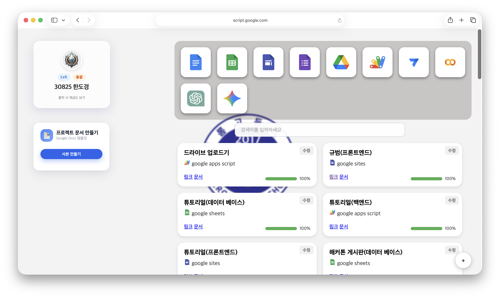
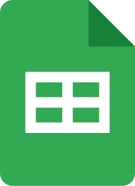
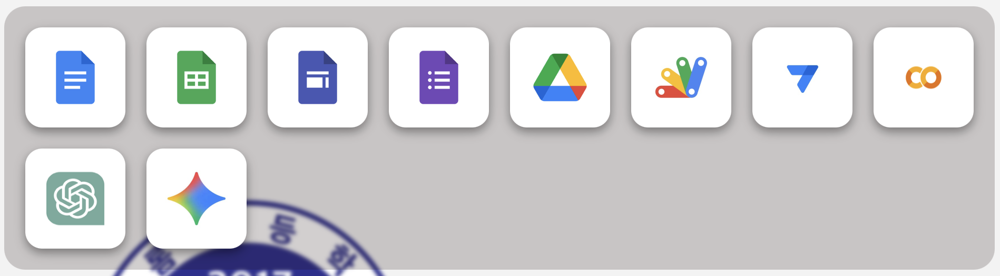

<h2><a href="https://sites.google.com/saerom.hs.kr/main/홈">SAEROM-student_main</a></h2>

<h2>Purpose</h2>

이 프로젝트는 학교에서 사용하는 크롬북의 불편함을 해결하기 위해 학생들의 편의를 중심으로 개발되었습니다.

<h2>Element</h2>
<h3>배너</h3>

이 요소는 학생들이 교내 행사와 공지 사항을 빠르게 확인할 수 있도록 중요한 정보를 시각적으로 정리된 배너 형태로 제공합니다.

    HTML
    CSS
    JavaScript
     
    Google Sites
    Google Sheets

<h3>크롬북 관리</h3>

이 요소는 학생들의 크롬북 반출 및 반납 내역을 쉽게 관리할 수 있도록 사용 사유와 시간을 기록하고 확인할 수 있는 관리 기능을 제공합니다.

    HTML
    CSS
    JavaScript
     
    Google Apps Script
    Google Sheets

<h3>검색창</h3>

이 요소는 학생들이 필요한 사이트나 정보를 빠르게 찾을 수 있도록 자주 사용하는 서비스와 데이터를 검색 기반으로 접근할 수 있게 제공합니다.

    HTML
    CSS
    JavaScript
     
    Google Sites

<h3>부가 기능</h3>

이 요소는 학생들의 크롬북 사용 편의성을 높일 수 있도록 자주 활용되는 보조 기능들을 하나의 환경에서 제공합니다.

    HTML
    CSS
    JavaScript
     
    Google Apps Script
    Google Sites
    Google Sheets

<h3>웹 런처</h3>

이 요소는 학생들이 자주 사용하는 웹 서비스를 빠르게 실행할 수 있도록 아이콘 기반의 웹 바로가기 기능을 제공합니다.

    HTML
    CSS
     
    Google Sites

<h3>gmail 알림</h3>

이 요소는 학생들이 중요한 메일을 놓치지 않도록 새로운 Gmail 알림을 실시간으로 확인할 수 있는 기능을 제공합니다.

    HTML
    CSS
    JavaScript
     
    Google Apps Script

<h3>수행평가 알림</h3>

이 요소는 학생들이 수행평가 일정을 체계적으로 관리할 수 있도록 평가 정보를 알림 형태로 제공합니다.

    HTML
    CSS
    JavaScript
     
    Google Apps Script

