<h2><a href="https://sites.google.com/saerom.hs.kr/techworks/홈">SAEROM-techworks_main</a></h2>

<h2>Purpose</h2>

이 프로젝트는 학교 프로그램을 개발하는 동아리원들의 불편함을 해결하기 위해 동아리원들의 편의를 중심으로 개발되었습니다.

<h2>Element</h2>
<h3>프로필</h3>

    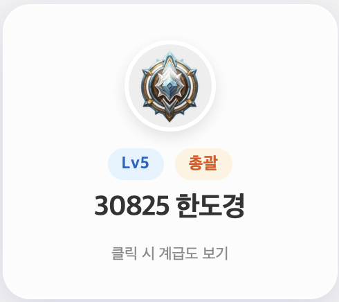
    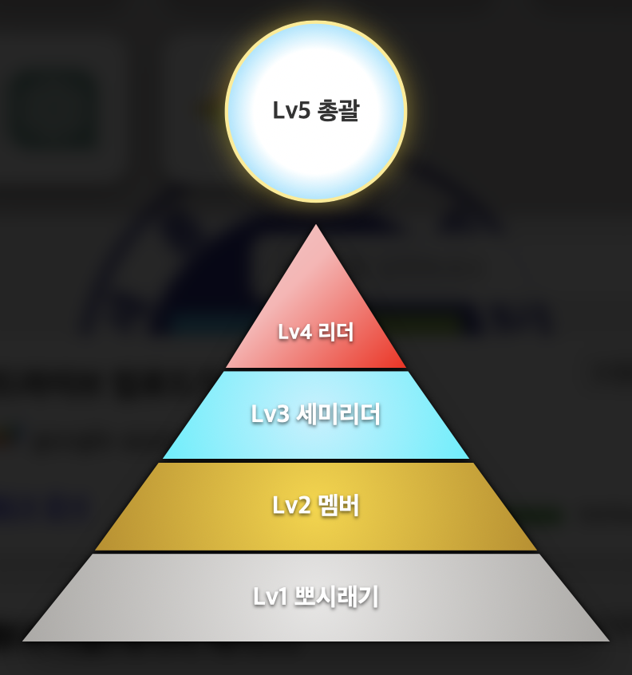

이 요소는 동아리원들이 동아리 권한 체계를 인지할 수 있도록 프로필 기능을 제공합니다.

    HTML
    CSS
    JavaScript
     
    Google Apps Script

<h3>웹 런처</h3>

이 요소는 동아리원들이 자주 사용하는 웹 서비스를 빠르게 실행할 수 있도록 아이콘 기반의 웹 바로가기 기능을 제공합니다.

    HTML
    CSS
     
    Google Apps Script

<h3>문서 생성기</h3>

이 요소는 동아리원들이 프로젝트를 진행하면서 프로젝트 문서를 쉽게 생성할 수 있도록 문서 생성 기능을 제공합니다.

    HTML
    CSS
    JavaScript
     
    Google Apps Script

<h3>레퍼런스</h3>
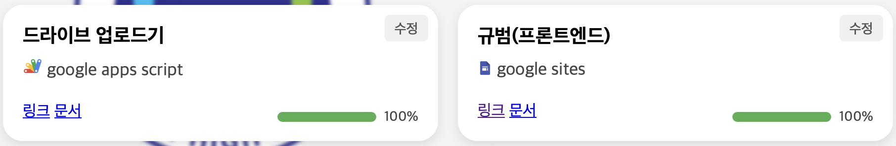

이 요소는 동아리원들이 프로젝트를 진행하면서 참고할 수 있도록 레퍼런스 기능을 제공합니다.

    HTML
    CSS
    JavaScript
     
    Google Apps Script
    Google Sheets

<h3>튜토리얼</h3>
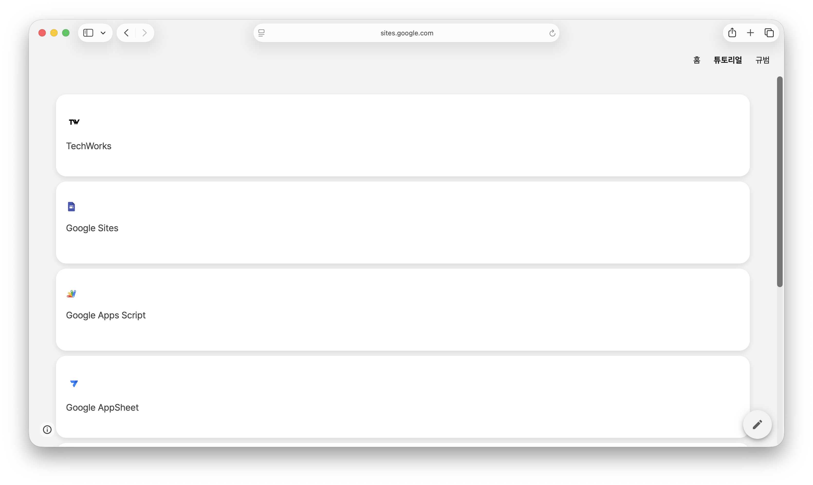

    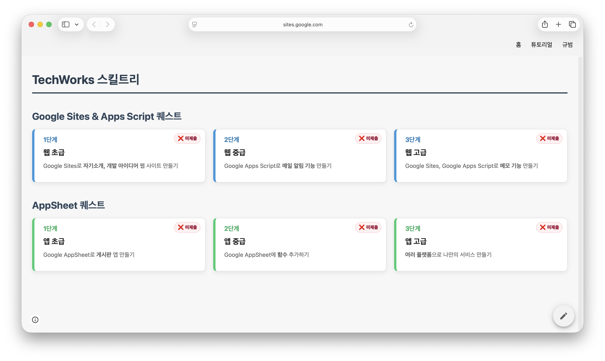
    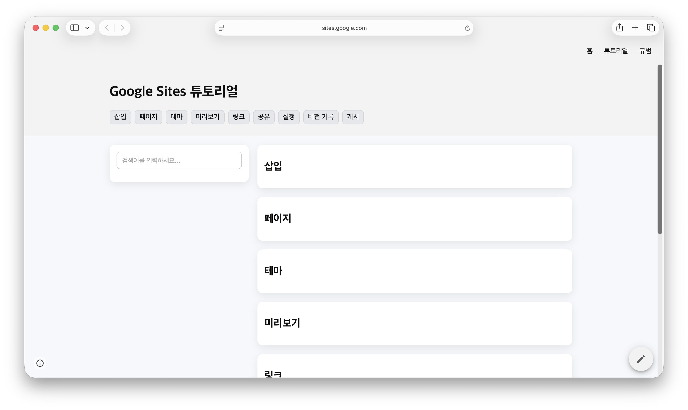
    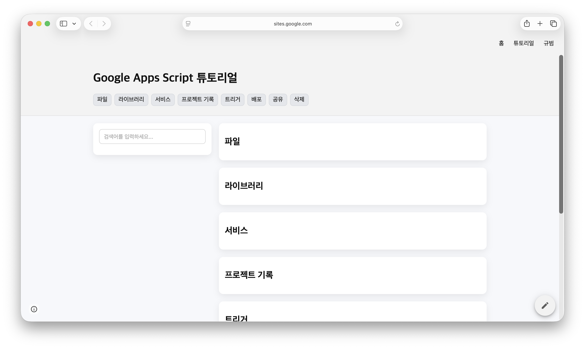
    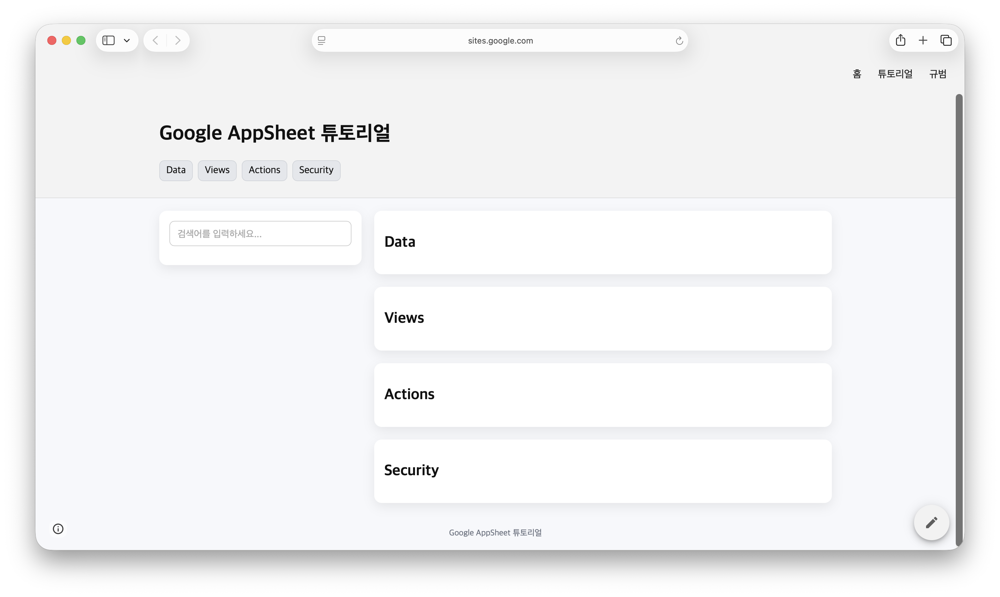
    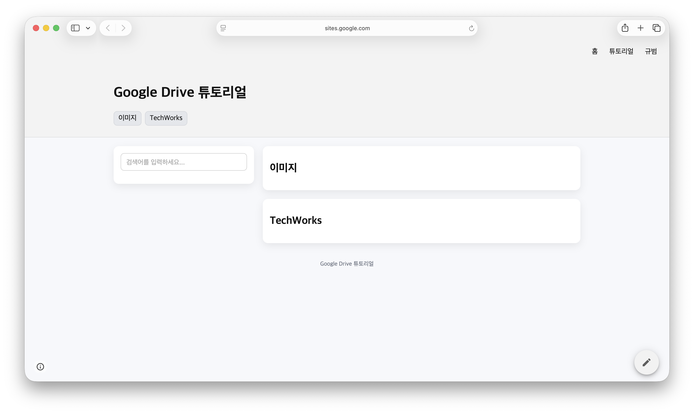
    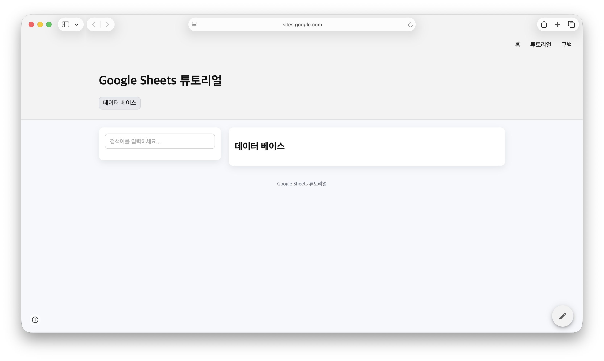
    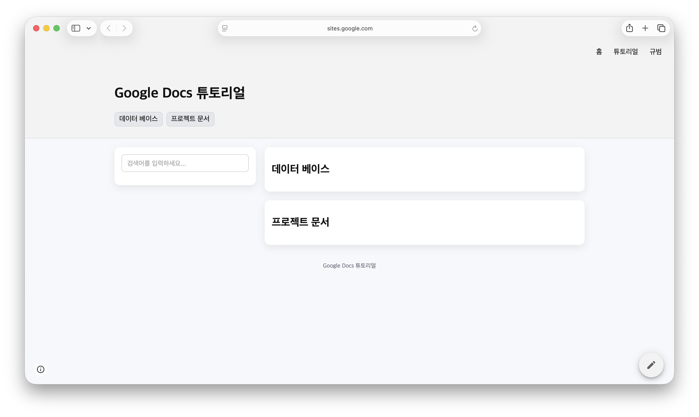

이 요소는 동아리원들이 개발에 필요한 기초 지식을 학습할 수 있도록 튜토리얼 기능을 제공합니다.

    HTML
    CSS
    JavaScript
     
    Google Sites
    Google Apps Script
    Google Sheets

<h3>규범</h3>
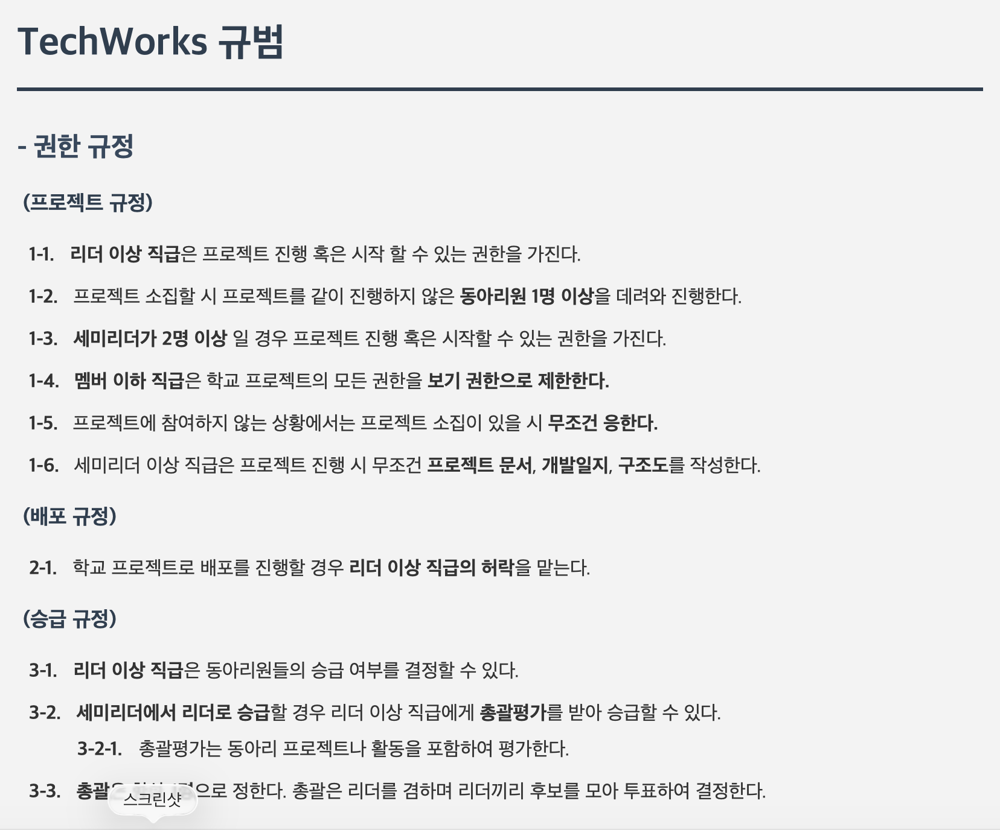

이 요소는 동아리원들이 동아리 규범 체계를 인지할 수 있도록 규범 기능을 제공합니다.

    HTML
    CSS
     
    Google Sites

