

  <a href="https://sites.google.com/saerom.hs.kr/techworks/홈">
    
     
    <b>SAEROM-techworks_main</b>
  </a>

  <b>프로그램 개발의 불편함을 해결하는 동아리원 편의 중심의 웹 사이트</b>

  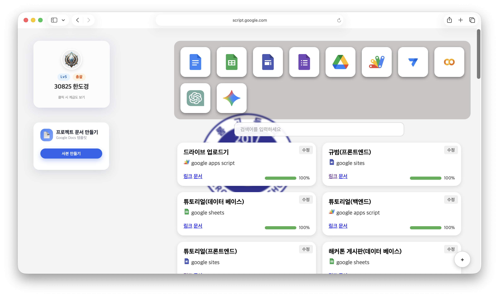

---

## 목차
1. [소개](#소개)
2. [구조](#구조)
3. [기능](#기능)
4. [기여](#기여)
5. [라이선스](#라이선스)

---

## 소개
<table>
<tr>
<th>항목</th>
<th>내용</th>
</tr>
<tr>
<td>프로젝트명</td>
<td>SAEROM-techworks_main</td>
</tr>
<tr>
<td>개발 목적</td>
<td>이 프로젝트는 학교 프로그램을 개발하는 동아리원들의 불편함을 해결하기 위해 동아리원들의 편의를 중심으로 개발되었습니다.</td>
</tr>
<tr>
<td>개발 기간</td>
<td>2025.11 ~ 2026.01</td>
</tr>
<tr>
<td>개발 인원</td>
<td>4명</td>
</tr>
<tr>
<td>운영 환경</td>
<td>학교 크롬북</td>
</tr>
<tr>
<td>사용자 수</td>
<td>18명</td>
</tr>
<tr>
<td>유지보수</td>
<td>TechWorks</td>
</tr>
<tr>
<td>서비스 상태</td>
<td>운영 중</td>
</tr>
<tr>
<td>Tech</td>
<td>
HTML
CSS
JavaScript
</td>
</tr>
<tr>
<td>Tool</td>
<td>
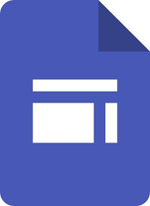Google Sites
Google Apps Script
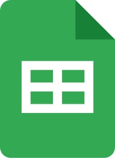Google Sheets
</td>
</tr>
</table> 

---

## 구조

  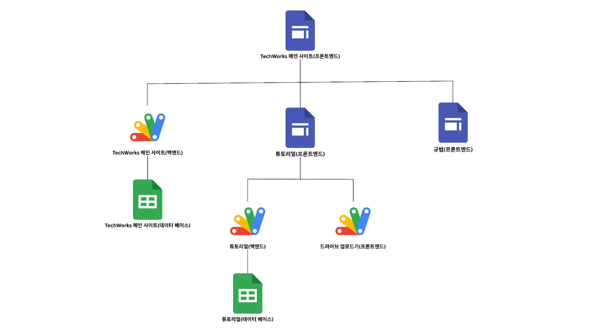

---

## 기능

<b>프로필</b>

 

  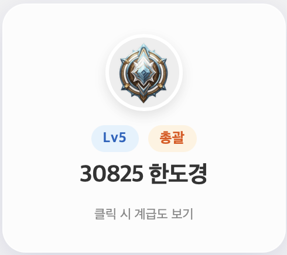
  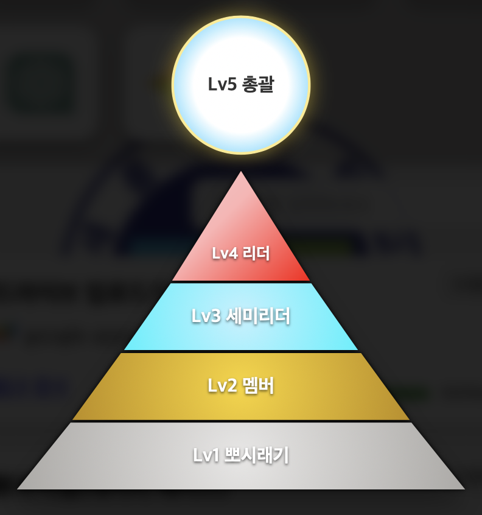
   
  HTML
  CSS
  JavaScript
   
  Google Apps Script
   
  이 요소는 동아리원들이 동아리 권한 체계를 인지할 수 있도록 프로필 기능을 제공합니다.

<b>웹 런처</b>

 

  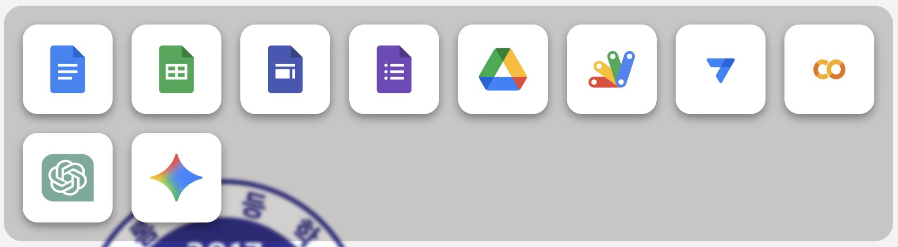
   
  HTML
  CSS
   
  Google Sites
   
  이 요소는 동아리원들이 자주 사용하는 웹 사이트에 쉽게 접근할 수 있도록 웹 런처 기능을 제공합니다.

<b>문서 생성기</b>

 

  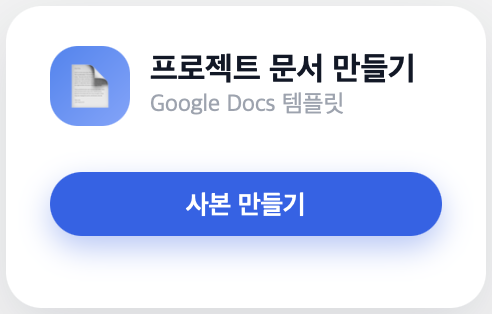
   
  HTML
  CSS
  JavaScript
   
  Google Apps Script
   
  이 요소는 동아리원들이 프로젝트를 진행하면서 프로젝트 문서를 쉽게 생성할 수 있도록 문서 생성기 기능을 제공합니다.

<b>레퍼런스</b>

 

  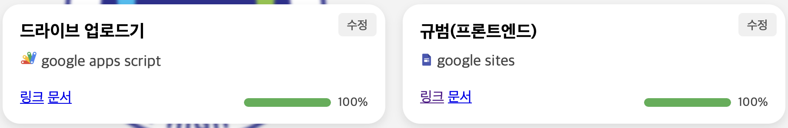
   
  HTML
  CSS
  JavaScript
   
  Google Apps Script
  Google Sheets
   
  이 요소는 동아리원들이 프로젝트를 진행하면서 참고할 수 있도록 레퍼런스 기능을 제공합니다.

<b>튜토리얼</b>

 

  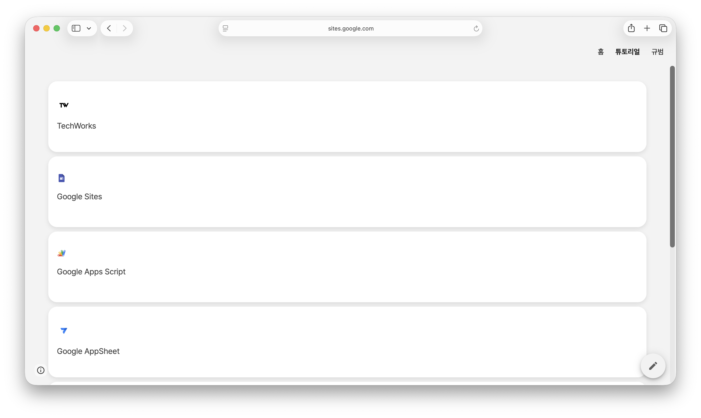
  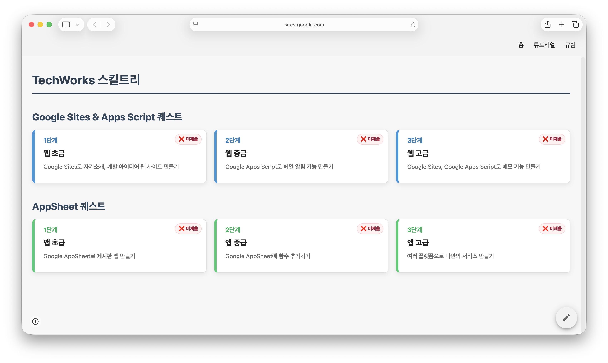
  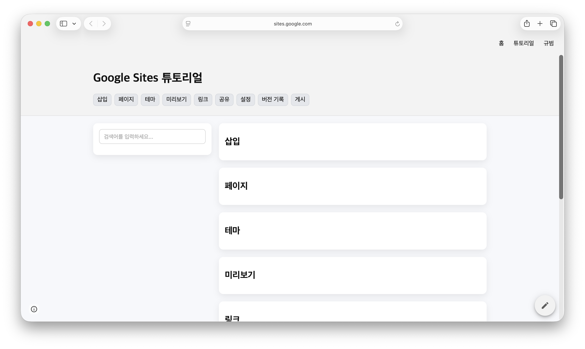
  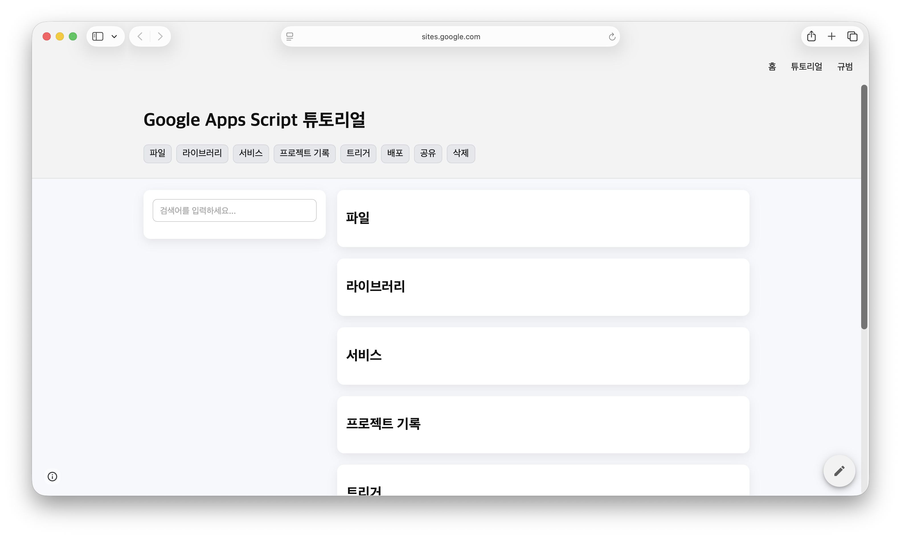
  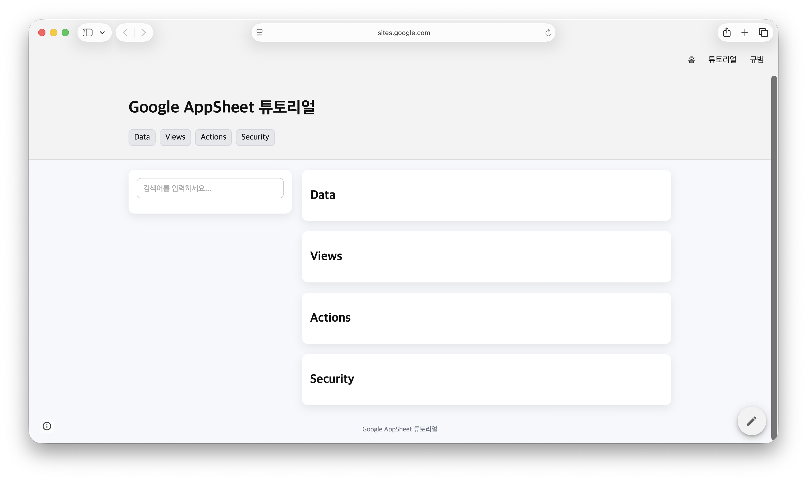
  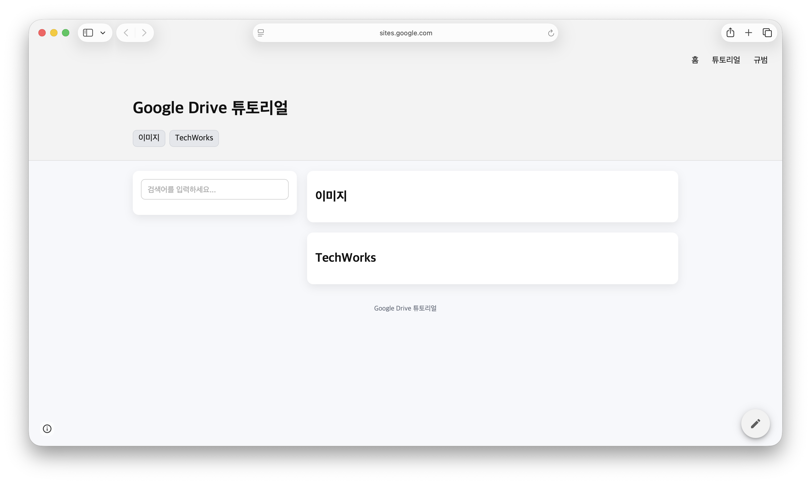
  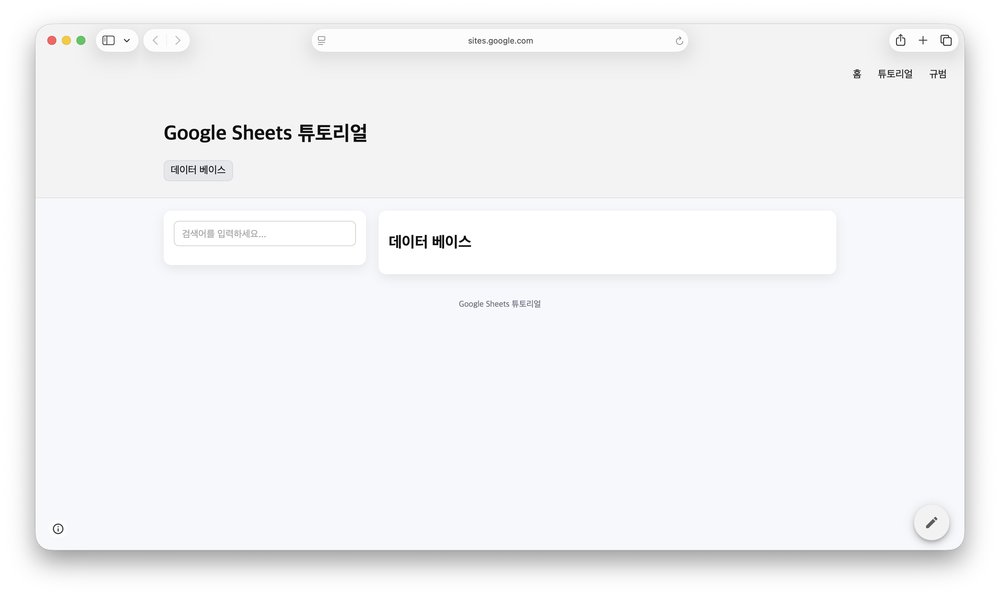
  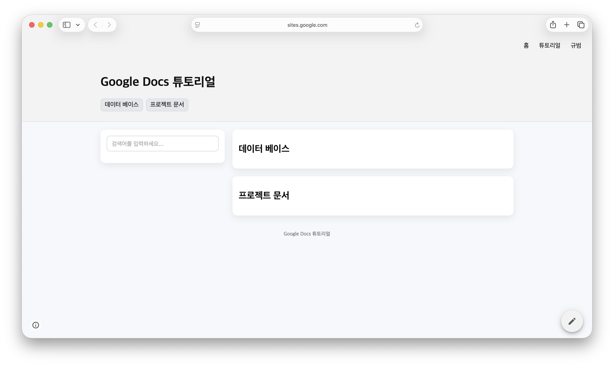
   
  HTML
  CSS
  JavaScript
   
  Google Sites
  Google Apps Script
  Google Sheets
   
  이 요소는 동아리원들이 개발에 필요한 기초 지식을 학습할 수 있도록 튜토리얼 기능을 제공합니다.

<b>규범</b>

 

  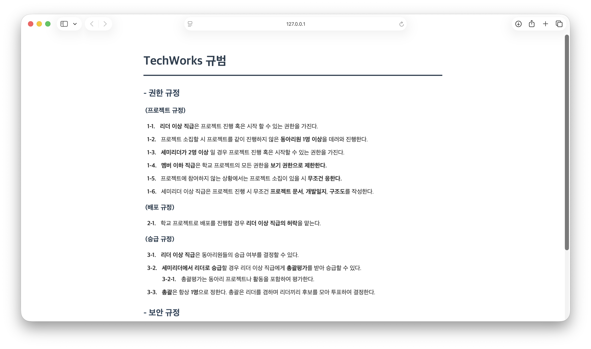
   
  HTML
  CSS
   
  Google Sites
   
  이 요소는 동아리원들이 동아리 규범 체계를 인지할 수 있도록 규범 기능을 제공합니다.

---

## 기여
한도경, 이율, 강민서, 이동하

---

## 라이선스
Copyright © 2025 SAEROM HIGH SCHOOL All rights reserved.
